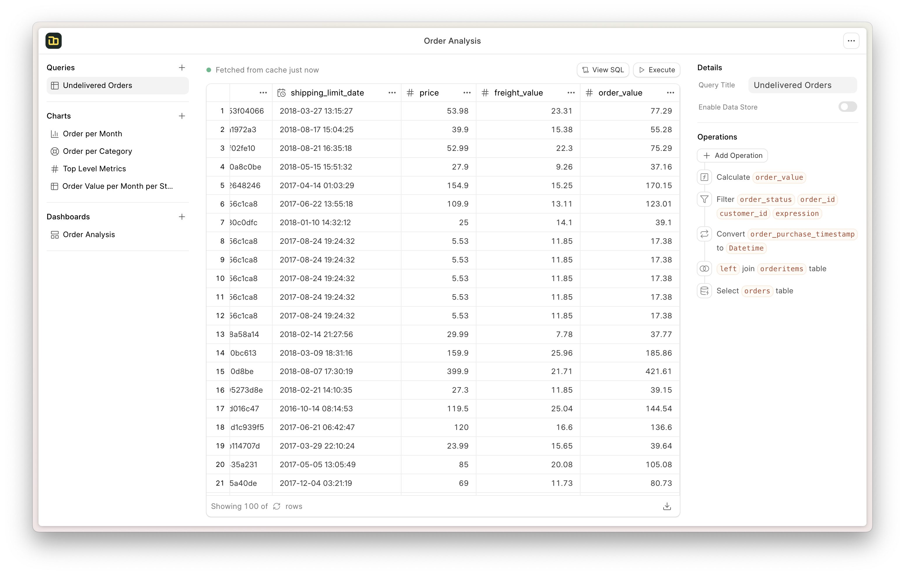
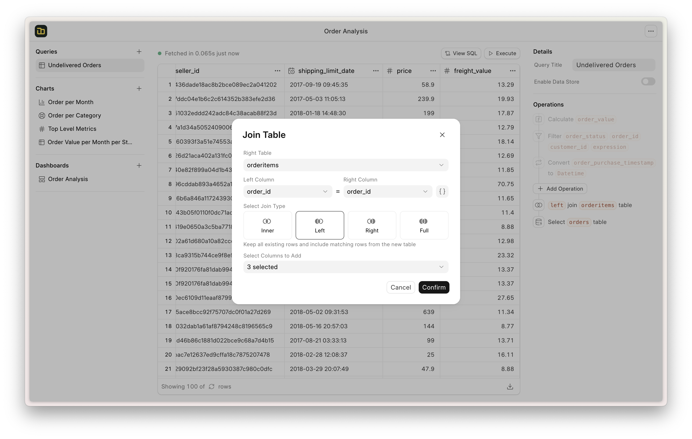
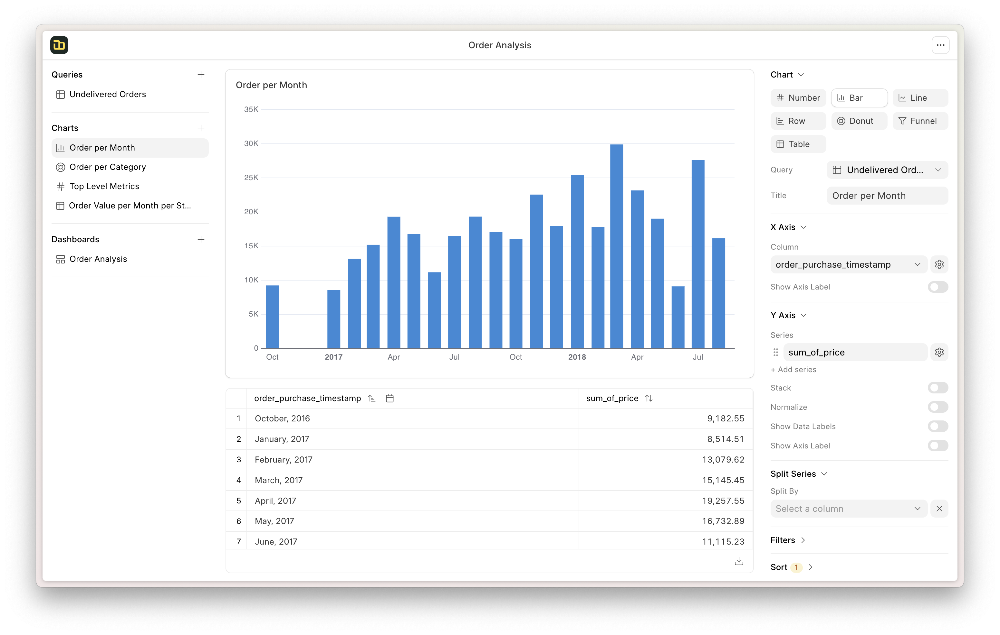

<div align="center" markdown="1">


<h1>Frappe Insights v3.0</h1>

**Open Source Business Intelligence & AI Analytics Platform for ERPNext**


[](https://codecov.io/github/frappe/insights)


</div>

<div align="center">
	
</div>
<br />
<div align="center">
    <a href="https://insightsdemo.frappe.cloud">Live Demo</a>
    -
    <a href="https://frappe.io/insights">Website</a>
    -
    <a href="https://docs.frappe.io/insights">Documentation</a>
</div>

---

## Overview

Frappe Insights is a comprehensive business intelligence platform built on the Frappe Framework, designed to transform ERPNext data into actionable intelligence. Version 3.0 introduces a full suite of **AI-powered intelligence dashboards**, **17 specialized AI agents**, **25+ ML modules**, and a **3-tier caching system** — all tightly integrated with ERPNext's financial, sales, inventory, HR, manufacturing, and CRM modules.

<details>
<summary>Screenshots</summary>




</details>

---

## Table of Contents

- [Key Features](#key-features)
- [Architecture](#architecture)
- [Intelligence Dashboards](#intelligence-dashboards)
- [AI Agent System](#ai-agent-system)
- [ML Analytics Modules](#ml-analytics-modules)
- [API Reference](#api-reference)
- [Configuration](#configuration)
- [Installation](#installation)
- [Development Setup](#development-setup)
- [Tech Stack](#tech-stack)
- [Compatibility](#compatibility)
- [License](#license)

---

## Key Features

### Core BI Platform
- **Multi-Source Connectivity** — Integrate data from MySQL, PostgreSQL, DuckDB, BigQuery, files, and spreadsheets
- **Visual Query Builder** — No-SQL query construction with table selection, joins, filters, and calculations
- **Visualizations & Dashboards** — Drag-and-drop dashboard builder with eCharts, automatic chart suggestions
- **Workbooks & Notebooks** — Collaborative analysis environments with query + chart + dashboard integration

### AI-Powered Intelligence (v3.0)
- **17 Specialized AI Agents** — Domain-specific chat assistants for every business function
- **Natural Language Queries** — Ask questions in plain English, get data-driven answers
- **OpenRouter AI Integration** — 11 free models with intelligent fallback (Mistral, Gemma, Llama, Qwen, GPT-OSS, DeepSeek, and more)
- **Smart Model Routing** — Automatic complexity-based model selection with quota management

### ML Analytics Engine
- **25+ ML Modules** — From sales forecasting to ESG sustainability scoring
- **Predictive Analytics** — Prophet time-series, RandomForest, XGBoost, IsolationForest for anomaly detection
- **Customer Intelligence** — CLV calculation, RFM segmentation, churn prediction, cohort analysis
- **ABC-XYZ Classification** — 9-cell inventory strategy matrix with demand variability analysis

### Enterprise Features
- **3-Tier Caching** — Redis (hot) → Database (warm) → API (cold) with automatic tier promotion
- **Performance Pipeline** — Thread-pool execution with 3 optimization levels and real-time metrics
- **ERPNext v15 Deep Integration** — Hooks into 9 ERPNext modules (Accounts, Selling, Buying, Stock, Manufacturing, Projects, CRM, HR, Assets)
- **Board Presentation Mode** — Executive-ready slide presentations with PowerPoint export
- **Cross-Dashboard Search** — Unified semantic search across all intelligence dashboards

---

## Architecture

```
insights/
├── agents/                # 17 AI chat agents + query router
│   ├── __init__.py        # BaseIntelligenceAgent ABC + AgentRegistry
│   ├── sales_agent.py     # Sales Intelligence agent
│   ├── financial_agent.py # Financial Intelligence agent
│   ├── hr_agent.py        # HR Intelligence agent (standalone)
│   ├── executive_agent.py # Executive Dashboard agent (standalone)
│   ├── query_router.py    # Natural language → agent routing
│   └── ...                # 12 more specialized agents
│
├── ai/
│   └── openrouter_client.py  # OpenRouter API client with model fallback
│
├── ai_reasoning/
│   └── model_router.py    # Complexity-based model routing + quota management
│
├── ml/                    # 25+ ML analytics modules
│   ├── base.py            # BaseMLModel ABC (train/predict interface)
│   ├── sales_intelligence.py
│   ├── financial_intelligence.py
│   ├── customer_intelligence/   # CLV, RFM, churn, health scoring
│   ├── strategic_finance/       # Cash flow, runway, scenario analysis
│   ├── demand_forecasting.py
│   ├── sales_forecasting.py     # Prophet + Exponential Smoothing
│   ├── payment_prediction.py    # RandomForest late-payment classifier
│   ├── abc_xyz_classification.py
│   └── ...
│
├── api/
│   ├── dashboard_chat.py  # Chat session management + agent dispatch
│   └── ml/                # 16 domain-specific API wrapper modules
│       ├── sales.py, financial.py, hr.py, executive.py
│       ├── inventory.py, procurement.py, risk.py, customer.py
│       ├── tax.py, esg.py, manufacturing.py, general.py
│       ├── predictive.py, search.py, strategic_finance.py
│       └── ...
│
├── cache_management/
│   └── cache_manager.py   # 3-tier cache (Redis/DB/API) + SmartCacheKey
│
├── performance/
│   └── performance_pipeline.py  # Optimization pipeline with metrics
│
├── integrations/
│   └── erpnext_v15_integrator.py  # 9-module ERPNext data sync
│
├── insights/doctype/      # 25 Frappe DocTypes
│   ├── insights_settings/         # Global config (AI, caching, quotas)
│   ├── dashboard_chat_session/    # Chat session persistence
│   ├── dashboard_ai_agent_config/ # Per-agent configuration
│   ├── insights_ai_query/         # Query audit trail
│   ├── ai_insight_alert/          # Intelligent alerting
│   └── ...
│
└── frontend/src2/         # Vue.js 3 frontend
    ├── intelligence/      # 12 intelligence dashboard views
    ├── dashboard/         # Core dashboard + domain views
    ├── components/        # Shared UI components
    │   ├── DashboardChatButton.vue  # AI chat floating button
    │   └── ...
    └── ai/                # AI insights views
```

---

## Intelligence Dashboards

| Dashboard | Route | Description |
|-----------|-------|-------------|
| **Executive Dashboard** | `/executive-dashboard` | C-suite view aggregating KPIs from all departments with RAG status indicators |
| **Sales Intelligence** | `/sales-intelligence` | Revenue trends, AOV, rep performance, pipeline analytics, fulfillment metrics |
| **Financial Intelligence** | `/financial-intelligence` | P&L, cash flow, financial ratios, receivables/payables, budget variance |
| **Strategic Finance** | `/strategic-finance-intelligence` | 13-week cash flow forecast, runway analysis, CAPEX planning, scenario analysis |
| **Inventory Intelligence** | `/inventory-intelligence` | Multi-warehouse stock, FIFO aging, dead stock, turnover, transfer recommendations |
| **Procurement Intelligence** | `/procurement-intelligence` | Spend analysis, supplier scorecards, purchase cycle, price intelligence |
| **Customer Intelligence** | `/customer-intelligence` | CLV, RFM segmentation, churn risk, 360° view, geographic insights |
| **Risk Intelligence** | `/risk-intelligence` | Credit, cash flow, operational, compliance risk scoring and prediction |
| **HR Intelligence** | `/hr-intelligence` | Headcount, attrition prediction, payroll optimization, workforce planning |
| **Manufacturing Intelligence** | `/manufacturing-intelligence` | OEE tracking, production efficiency, quality metrics, capacity planning |
| **Marketing & CRM** | `/marketing-crm-intelligence` | Pipeline analysis, campaign effectiveness, lead scoring, marketing ROI |
| **Tax Intelligence** | `/tax-intelligence` | Kenya Corporate Tax (30%), capital allowances, KRA quarterly scheduling, WHT |
| **ESG Intelligence** | `/esg-intelligence` | Environmental/Social/Governance metrics, carbon tracking, sustainability reporting |
| **Budget Variance** | `/strategic-finance-intelligence` | Budget vs actual, forecast accuracy, department performance, variance alerts |
| **Board Presentation** | `/board-presentation` | Full-screen executive presentations with PowerPoint export |

Each dashboard includes an **AI chat assistant** (floating chat button) for natural-language interaction with the data.

---

## AI Agent System

### Agent Architecture

The system uses two agent patterns:

1. **BaseIntelligenceAgent subclasses** — Sales, Risk, Inventory, Procurement, Financial, Customer, General, Tax agents extend a common abstract base class with `execute()` and `get_quick_actions()` methods
2. **Standalone agents** — HR, Executive, Marketing, Manufacturing, ESG agents have their own `get_insights(query)` interface, wrapped by `StandaloneAgentAdapter` for chat pipeline compatibility

### Chat Pipeline

```
User Message → DashboardChatButton.vue
    → insights.api.dashboard_chat.send_message()
        → get_agent_for_dashboard(dashboard_type)
            → agent.execute(query, session_id, context, history)
                → OpenRouterClient._make_request(messages, model)
                    → OpenRouter API (with model fallback chain)
    ← AI Response → displayed in chat UI
```

### Model Fallback Strategy

The OpenRouter client tries models in priority order, with fast-fail on rate limits:

1. **Primary model** (configurable, default: Mistral Small 3.1 24B)
2. **Fallback model** (configurable, default: Gemma 3 27B)
3. **11 free models** rotated through automatically
4. **Early exit** after 3 consecutive rate limits (prevents extended blocking)
5. **Paid models** (GPT-4o-mini, GPT-4o, Claude 3.5 Sonnet) as final fallback

### Available Agents

| Agent | Type | Capabilities |
|-------|------|-------------|
| Sales | BaseAgent | Revenue analysis, growth drivers, sales rep performance |
| Financial | BaseAgent | P&L analysis, cash flow, financial ratios, forecasting |
| Inventory | BaseAgent | Stock optimization, reorder points, dead stock identification |
| Procurement | BaseAgent | Spend analysis, supplier evaluation, cost optimization |
| Customer | BaseAgent | Segmentation, churn risk, lifetime value, engagement |
| Risk | BaseAgent | Credit scoring, operational risk, compliance monitoring |
| Tax | BaseAgent | Tax liability, allowances, KRA compliance, WHT tracking |
| General | BaseAgent | Cross-domain queries, general business intelligence |
| HR | Standalone | Workforce analytics, attrition prediction, payroll insights |
| Executive | Standalone | Aggregated C-suite KPIs, organizational health |
| Marketing | Standalone | Campaign ROI, lead quality, pipeline optimization |
| Manufacturing | Standalone | Production efficiency, OEE, quality metrics |
| ESG | Standalone | Sustainability metrics, carbon tracking, governance |
| Budget Variance | Specialized | Budget vs actual, forecast accuracy |
| Predictive Analytics | Specialized | Cross-domain forecasting, anomaly detection |
| Cross-Dashboard Search | Specialized | Semantic search across all dashboards |
| Query Router | Router | Natural language query → correct agent routing |

---

## ML Analytics Modules

### Predictive Models

| Module | Algorithm | Purpose |
|--------|-----------|---------|
| **Sales Forecasting** | Prophet, Exponential Smoothing, SMA | Daily/weekly/monthly sales prediction by customer and item group |
| **Demand Forecasting** | Seasonal Decomposition, Trend Detection | Item-level demand, reorder points, safety stock, stock-out probability |
| **Payment Prediction** | RandomForestClassifier | Late payment probability, expected days-to-pay, at-risk invoices |
| **Advanced Predictive** | RandomForestRegressor, IsolationForest, Ridge | Multi-domain forecasting, anomaly detection, cross-domain correlation |
| **Customer Segmentation** | RFM Analysis | 11-segment classification (Champions → Lost) with scoring |
| **ABC-XYZ Classification** | Pareto + CV Analysis | 9-cell inventory strategy matrix (AX through CZ) |
| **Product Recommendations** | Association Rules, Collaborative/Content Filtering | Market basket analysis, item similarity, cross-sell recommendations |

### Intelligence Analysis Modules

| Module | Lines | Key Capabilities |
|--------|-------|-----------------|
| **Sales Intelligence** | 964 | Revenue metrics, cash/credit mix, territory analysis, DSO, backlog |
| **Financial Intelligence** | 1,304 | P&L, cash flow forecasting, ratios, KRA tax analysis (Kenya-specific) |
| **Risk Intelligence** | 997 | Multi-domain risk scoring (0-100), Prophet predictive risk, anomaly detection |
| **Tax Intelligence** | 1,173 | Kenya Corporate Tax (30%), Class I-IV capital allowances, WHT tracking |
| **Budget Variance** | 1,757 | Budget vs actual, forecast accuracy, automated variance alerts |
| **ESG Intelligence** | 1,484 | Environmental/Social/Governance metrics, sustainability reporting |
| **Executive Intelligence** | 1,009 | Unified C-suite KPIs from all departments, RAG status indicators |
| **Marketing Intelligence** | 989 | Pipeline analysis, lead scoring, campaign effectiveness |
| **Inventory Intelligence** | 704 | Multi-warehouse, FIFO aging, ABC-XYZ integration, procurement optimization |
| **Procurement Intelligence** | 679 | Supplier scorecards, price variance, risk assessment |
| **HR Intelligence** | 655 | Attrition prediction, payroll optimization, workforce planning |
| **Manufacturing Intelligence** | 627 | OEE tracking, quality metrics, capacity planning |
| **Customer Intelligence** | Package | CLV (BG/NBD), RFM, churn prediction, health scoring, cohort analysis |
| **Strategic Finance** | Package | 13-week cash flow, runway, CAPEX, scenario analysis (Monte Carlo) |
| **Cross-Dashboard Search** | 910 | Semantic search, relevance scoring, intelligent routing |
| **Presentation Service** | 676 | Board-ready slides, PowerPoint export, executive summary generation |

---

## API Reference

### Dashboard Chat API

```python
# Start a new AI chat session
insights.api.dashboard_chat.start_new_session(dashboard_type="Sales")

# Send a message to the AI agent
insights.api.dashboard_chat.send_message(
    session_id="CHAT-2026-00004",
    query="Analyze revenue trends",
    context='{"period": "last_quarter"}'
)

# Get session history
insights.api.dashboard_chat.get_session(session_id="CHAT-2026-00004")

# Get recent sessions
insights.api.dashboard_chat.get_recent_sessions(dashboard_type="Sales")
```

### AI Analysis API

```python
# Direct AI analysis
insights.ai.openrouter_client.chat_with_ai(
    prompt="What are the top growth drivers?",
    context='{"revenue": 5000000, "growth": 12.5}'
)

# Get AI status and quota
insights.ai.openrouter_client.get_ai_status()

# Test API connection
insights.ai.openrouter_client.test_connection()
```

### ML Domain APIs

Each domain has a dedicated API module under `insights.api.ml.*`:

```python
# Sales
insights.api.ml.sales.get_sales_intelligence()
insights.api.ml.sales.get_revenue_analysis()

# Financial
insights.api.ml.financial.get_financial_intelligence()
insights.api.ml.financial.get_cash_flow_analysis()

# Inventory
insights.api.ml.inventory.get_inventory_intelligence()
insights.api.ml.inventory.get_stock_optimization()

# And 13 more domain APIs...
```

---

## Configuration

### Insights Settings

Navigate to **Insights Settings** in the Frappe Desk:

| Setting | Default | Description |
|---------|---------|-------------|
| `enable_ai_analytics` | Off | Enable AI-powered analytics |
| `openrouter_api_key` | — | OpenRouter API key ([get one free](https://openrouter.ai)) |
| `ai_model` | Mistral Small 3.1 24B | Primary AI model |
| `ai_model_fallback` | Gemma 3 27B | Fallback AI model |
| `daily_ai_quota` | 100 | Maximum AI queries per day |
| `refresh_schedule` | Disabled | Automated insight refresh (Daily/Weekly/Monthly) |
| `query_result_expiry` | 10 min | Query cache TTL |
| `query_result_limit` | 1,000 | Max rows returned per query |

### Environment Variables

```bash
# Alternative to storing API key in settings
export OPENROUTER_API_KEY="sk-or-v1-..."
```

### Caching Configuration

The 3-tier caching system uses these TTLs:

| Tier | Backend | Default TTL | Usage |
|------|---------|-------------|-------|
| **Hot** | Redis | 1 hour | Frequently accessed real-time data |
| **Warm** | MariaDB | 24 hours | Pre-computed aggregations |
| **Cold** | MariaDB | 7 days | ML model results, complex computations |

---

## Installation

### Prerequisites

- Frappe Framework >= v15.0.0
- ERPNext >= v15.0.0
- Python >= 3.10
- Node.js >= v18
- Redis (for caching)

### Quick Install

```bash
bench get-app https://github.com/frappe/insights.git --branch version-3
bench --site your-site.local install-app insights
bench --site your-site.local migrate
bench build --app insights
```

### Optional ML Dependencies

```bash
# Machine Learning (forecasting, classification, anomaly detection)
pip install scikit-learn>=1.3.0 xgboost>=2.0.0 lightgbm>=4.1.0 prophet>=1.1.4

# NLP (text analysis, embeddings)
pip install transformers>=4.36.0 sentence-transformers>=2.2.0 spacy>=3.7.0

# Vector Database (semantic search)
pip install chromadb>=0.4.0 faiss-cpu>=1.7.4

# Export (PDF, Excel, PowerPoint)
pip install plotly weasyprint python-pptx reportlab openpyxl
```

Or install all optional dependencies at once:

```bash
pip install insights[all]
```

### Production Deployment

<details>
<summary>Self-hosted with Docker</summary>

**Step 1**: Download the easy install script

```bash
wget https://frappe.io/easy-install.py
```

**Step 2**: Run the deployment command

```bash
python3 ./easy-install.py deploy \
    --project=insights_prod_setup \
    --email=your_email@example.com \
    --image=ghcr.io/frappe/insights \
    --version=stable \
    --app=insights \
    --sitename subdomain.domain.tld
```

**Step 3**: Enable Server Scripts

```bash
docker compose -p insights_prod_setup exec backend bench set-config -g server_script_enabled 1
```

**Step 4**: Access the site at `https://subdomain.domain.tld/`

</details>

### Managed Hosting

Deploy on [Frappe Cloud](https://frappecloud.com) for a fully managed experience:

<div>
    <a href="https://frappecloud.com/insights/signup" target="_blank">
        <picture>
            <source media="(prefers-color-scheme: dark)" srcset="https://frappe.io/files/try-on-fc-white.png">
            
        </picture>
    </a>
</div>

---

## Development Setup

### Docker

```bash
mkdir frappe-insights && cd frappe-insights
wget -O docker-compose.yml https://raw.githubusercontent.com/frappe/insights/develop/docker/docker-compose.yml
wget -O init.sh https://raw.githubusercontent.com/frappe/insights/develop/docker/init.sh
docker compose up -d
```

Access at [http://insights.localhost:8000/insights](http://insights.localhost:8000/insights) (admin/admin)

### Local

```bash
# 1. Setup bench (see https://frappeframework.com/docs/user/en/installation)
bench start

# 2. Install the app
bench get-app insights
bench new-site insights.test --install-app insights
bench --site insights.test add-to-hosts

# 3. Start frontend dev server
cd apps/insights
yarn && yarn dev
```

Access at `http://insights.test:8080`

### Project Structure

```
apps/insights/
├── hooks.py               # Frappe hooks (scheduler, doc_events, routes)
├── pyproject.toml          # Dependencies and build config
├── requirements*.txt       # Optional dependency groups (ml, nlp, vectordb, export)
├── insights/               # Python backend
│   ├── agents/             # 17 AI agents + query router
│   ├── ai/                 # OpenRouter client
│   ├── ai_reasoning/       # Complexity-based model routing
│   ├── ml/                 # 25+ ML analytics modules
│   ├── api/                # REST API endpoints + 16 ML domain wrappers
│   ├── cache_management/   # 3-tier caching (Redis/DB/API)
│   ├── performance/        # Thread-pool optimization pipeline
│   ├── integrations/       # ERPNext v15 integrator (9 modules)
│   └── insights/doctype/   # 25 Frappe DocTypes
└── frontend/               # Vue.js 3 + Tailwind CSS
    └── src2/
        ├── intelligence/   # 12 intelligence dashboard views
        ├── dashboard/      # Core + domain dashboards
        ├── components/     # Shared UI (chat button, charts, controls)
        ├── workbook/       # Collaborative workbooks
        ├── query/          # Query builder
        └── ai/             # AI insights views
```

---

## Tech Stack

### Backend
| Technology | Purpose |
|-----------|---------|
| [Frappe Framework](https://github.com/frappe/frappe) | Full-stack web application framework |
| [OpenRouter](https://openrouter.ai) | AI model gateway (11 free + paid models) |
| [scikit-learn](https://scikit-learn.org) | ML models (RandomForest, IsolationForest, Ridge) |
| [Prophet](https://facebook.github.io/prophet/) | Time-series forecasting |
| [Ibis](https://github.com/ibis-project/ibis) | SQL composition with dataframe APIs |
| [pandas](https://pandas.pydata.org) + [NumPy](https://numpy.org) | Data manipulation and computation |
| [Redis](https://redis.io) | Hot-tier caching |
| [XGBoost](https://xgboost.readthedocs.io) / [LightGBM](https://lightgbm.readthedocs.io) | Gradient boosting models |

### Frontend
| Technology | Purpose |
|-----------|---------|
| [Vue.js 3](https://vuejs.org) | Reactive UI framework |
| [Frappe UI](https://github.com/frappe/frappe-ui) | Vue component library |
| [eCharts](https://echarts.apache.org) | Interactive charts and visualizations |
| [Tailwind CSS](https://tailwindcss.com) | Utility-first CSS framework |

### Supported Databases
MySQL / MariaDB · PostgreSQL · DuckDB · BigQuery

---

## Compatibility

| Insights Branch | Frappe Framework | ERPNext | Node | Python |
|----------------|-----------------|---------|------|--------|
| main           | v14, v15        | v14, v15 | v18+ | 3.10+ |
| version-3      | v14, v15        | v14, v15 | v18+ | 3.10+ |
| develop        | develop         | develop  | v18+ | 3.10+ |

### Optional App Integration

| App | Integration |
|-----|-------------|
| **HRMS** (>= v15) | HR Intelligence — workforce analytics, attrition prediction, payroll optimization |
| **Payments** (>= v0.0.1) | Payment prediction, cash flow analysis |

---

## DocTypes

<details>
<summary>25 DocTypes included</summary>

| DocType | Purpose |
|---------|---------|
| Insights Settings | Global config (AI, caching, quotas) |
| Dashboard Chat Session | AI chat session persistence |
| Dashboard AI Agent Config | Per-agent model and behavior settings |
| Insights AI Query | Query audit trail and analytics |
| AI Insight Alert | Threshold-based intelligent alerting |
| AI Insight Feedback | User feedback on AI responses |
| AI Insight Share | Insight sharing and permissions |
| AI Usage Log | AI API usage tracking |
| Insights Alert | General alert management |
| Insights Chart v3 | Chart definitions |
| Insights Dashboard Chart v3 | Dashboard-chart relationships |
| Insights Dashboard v3 | Dashboard definitions |
| Insights Data Source v3 | Data source connections |
| Insights Folder | Organizational folders |
| Insights Notebook | Interactive notebooks |
| Insights Query Execution Log | Query performance logging |
| Insights Query v3 | Saved queries |
| Insights Query Variable | Parameterized query variables |
| Insights Resource Permission | Resource-level permissions |
| Insights Table Link v3 | Table relationship definitions |
| Insights Table v3 | Table metadata |
| Insights Team | Team management |
| Insights Team Member | Team membership |
| Insights User Invitation | User invitation workflow |
| Insights Workbook | Workbook definitions |

</details>

---

## Scheduled Tasks

| Frequency | Tasks |
|-----------|-------|
| **Hourly** | Data aggregation, real-time dashboard updates, ERPNext data sync, AI model monitoring, cache cleanup |
| **Daily** | BI report generation, executive/HR/manufacturing intelligence updates, customer analytics, sales forecasting, inventory recommendations, performance metrics archival |
| **Weekly** | Comprehensive business analysis, customer segmentation, financial trends, manufacturing efficiency, workforce analytics, model performance evaluation |
| **Monthly** | Executive reports, CLV analysis, financial forecasting, strategic recommendations, ML model retraining |

---

## ERPNext Integration

The app hooks into ERPNext document events and syncs data from 9 modules:

| Module | DocTypes | Analytics |
|--------|----------|-----------|
| **Accounts** | Sales/Purchase Invoice, Payment Entry, GL Entry | Financial analysis, cash flow, P&L, balance sheet |
| **Selling** | Sales Order, Quotation, Delivery Note | Sales analytics, customer insights, forecasting |
| **Buying** | Purchase Order, Purchase Receipt | Procurement analytics, supplier performance |
| **Stock** | Stock Entry, Item, Warehouse | Inventory optimization, stock analysis, reorder planning |
| **Manufacturing** | Work Order, BOM, Job Card | Production analytics, OEE, resource planning |
| **Projects** | Project, Task, Timesheet | Project tracking, resource utilization |
| **CRM** | Lead, Opportunity, Contact | Lead scoring, conversion analysis, customer journey |
| **HR** | Employee, Attendance, Salary Slip | Workforce analytics, performance metrics |
| **Assets** | Asset, Asset Movement, Asset Maintenance | Utilization tracking, maintenance scheduling |

---

## Learn and Connect

- [Telegram Public Group](https://t.me/frappeinsights)
- [Discussion Forum](https://discuss.frappe.io/c/insights/74)
- [Documentation](https://docs.frappe.io/insights)
- [YouTube](https://www.youtube.com/@frappetech)

---

## License

[GNU Affero General Public License v3.0](license.txt)

<br>
<div align="center" style="padding-top: 0.75rem;">
    <a href="https://frappe.io" target="_blank">
        <picture>
            <source media="(prefers-color-scheme: dark)" srcset="https://frappe.io/files/Frappe-white.png">
            
        </picture>
    </a>
</div>
